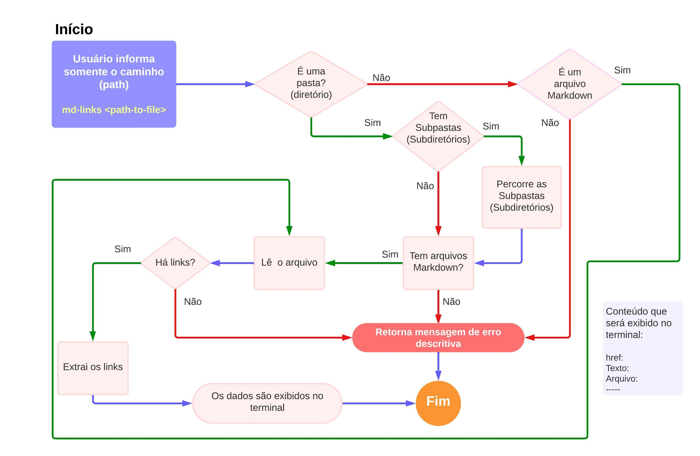
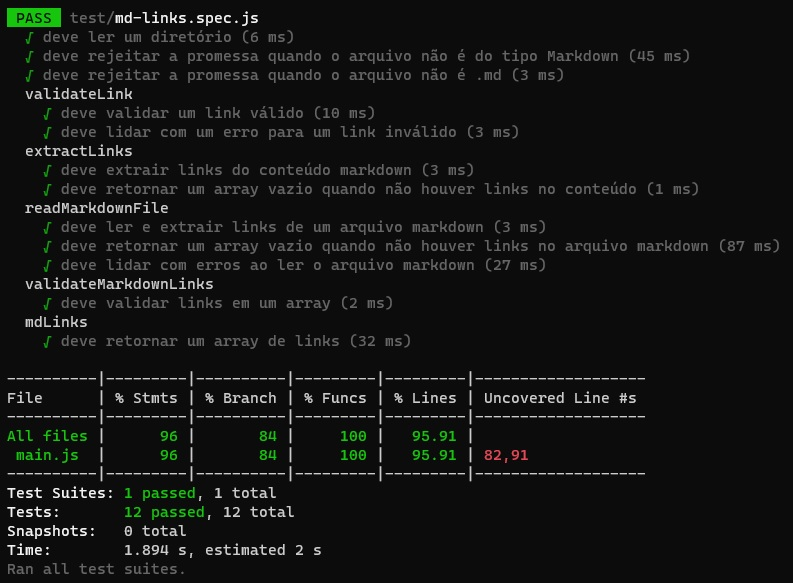

# Markdown Links

## Índice

* [1. Prefácio](#1-prefácio)
* [2. Objetivo](#2-objetivo)
* [3. Interface](#3-Interface)
  *[3.1.1 Parâmetros](#311-parâmetros)
    *[3.1.2 Valor de Retorno](#312-valor-de-retorno)
* [4. Instalação](#4-instalação)
* [5. Guia de Uso](#5-guia-de-uso)
  * [5.1. Informando o caminho (path)](#51-informando-o-caminho-(path))
     * [5.1.1. Fluxograma](#511-fluxograma)
     *[5.2. Informando o caminho e a opção --validate](#52-informando-o-caminho-e-a-opção---validate)
      *[5.2.1. Fluxograma](#521-fluxograma)
      *[5.3. Informando o path e --stats](#53-informando-o-path-e---stats)
      *[5.4. Informando o path, --stats e --validate](#54-informando-o-path---stats-e---validate)
      *[5.4.1. Fluxograma](#541-fluxograma)
* [6. Cobertura dos Testes](#6-cobertura-de-testes)
* [7. Contato](#8-contato)


***

## 1. Prefácio

[Markdown](https://pt.wikipedia.org/wiki/Markdown) é uma linguagem de marcação
muito popular entre os programadores. É usada em muitas plataformas que
manipulam texto (GitHub, fórum, blogs e etc) e é muito comum encontrar arquivos
com este formato em qualquer repositório (começando pelo tradicional
`README.md`).

Os arquivos `Markdown` normalmente contém _links_ que podem estar
quebrados, ou que já não são válidos, prejudicando muito o valor da
informação que está ali.

Para este projeto, tendo este cenário em vista, foi criada uma biblioteca para verificar se existem links, e se os mesmos estão válidos, dentro de arquivos `Markdown`.


## 2. Objetivo 

O pacote `md-links-cnpg` foi criado com o objetivo de auxiliar os usuários a encontrarem links dentro de arquivos do tipo `Markdown` (normalmente reconhecidos por terem como extensão `.md` ). Ela foi desenvolvida a partir da ferramenta de linha de comando (CLI), e disponibilizada na biblioteca `npm`.

## 3. Interface

O módulo oferece a seguinte interface:

`mdLinks(path, options)`

##### 3.1.1. Parâmetros

* `path`: Rota absoluta ou relativa ao arquivo ou diretório.
* `options`: Um objeto com a seguinte propriedade:
  - `validate`: Um booleano que determina se deseja validar os links encontrados.
  - `stats`: Booleano que determina se deseja obter um output com informações estatísticas gerais.

##### 3.1.2. Valor de retorno

A função **retorna uma promessa** (`Promise`) que
**resolve um array** (`Array`) de objetos (`Object`), onde cada objeto representa um link, contendo as seguintes propriedades:

Apenas com o parâmetro `path`:

* `href`: URL encontrada.
* `Texto`: Texto que faz referência ao link.
* `Arquivo`: Rota do arquivo onde foi encontrado o link.

Com os parâmetros: `path` e `--validate`:

* `href`: URL encontrada.
* `Texto`: Texto que faz referência ao link.
* `Arquivo`: Rota do arquivo onde foi encontrado o link.
* `status`: Código de resposta HTTP, OU `N/A`
* `Ok`: Mensagem `FAIL` em caso de falha ou `OK` em caso de sucesso.

Com os parâmetros: `path` e `--stats`:

* `Total de links`: Número total de links encontrados.
* `Links únicos`: Número de links que não se repetem.

Com os parâmetros: `path`, `--validate` e `--stats`:

* `Total de links`: Número total de links encontrados.
* `Links únicos`: Número de links que não se repetem.
* `links Quebrados`: Quantidade de links quebrados.

## 4. Instalação

Para começar a usar o `md-links-cnpg`, você precisa tê-lo instalado no seu projeto. Para fazer isso, abra o terminal e execute o seguinte comando:

```sh
$ npm install md-links-cnpg
```
**Pré-requisitos:**

* instalação do noje.js versão >16;
* instalação do gitbash para utiliza-lo como ambiente de execução.

## 5. Guia de Uso

A lib deve ser usada no terminal via linha de comando, recomendamos a utilização do Git Bash para evitar problemas de permissão.

Existem quatro formas de buscar por links dentro de arquivos `.md` usando esta lib, são elas:

### 5.1. Informando somente o caminho (path)

O Markdown Links utiliza o comando md-links para fazer a busca e recebe como parâmetro o `path` absoluto ou relativo.

Exemplo de utilização do comando:

```sh
$ md-links <path-to-file>
```
Sendo que em  <path-to-file> você insere o caminho do arquivo que deseja analisar 

Exemplo de retorno que será exibido no terminal:

```sh
href: https://www.google.com/ 
Texto: Google
Arquivo: path/arquivo.md

href: https://www.facebook.com/ 
Texto: Facebook
Arquivo: path/arquivo.md
```
#### 5.1.1. Fluxograma

**Cenário 1: md-links executado apenas com o parâmetro path**

**Pré-requisito:** inserir um path válido.



### 5.2. Informando o caminho e a opção --validate

Exemplo de utilização do comando:

```sh
$ md-links <path-to-file> --validate
```
Sendo que em  <path-to-file> você insere o caminho do arquivo que deseja analisar 

Exemplo de retorno que será exibido no terminal:

```sh
href: https://www.google.com/ 
Texto: Google
Arquivo: path/arquivo.md
Status: 200
Ok: Ok

href: https://www.goosgle.com/
Texto: Google
Arquivo: path/arquivo.md
Status: N/A
Ok: FAIL
```
#### 5.2.1. Fluxograma

**Cenário 2: md-links executado com os parâmetros path e --validate**

**Pré-requisito:** inserir um path válido.


### 5.3. Informando o path e --stats

Exemplo de utilização do comando:

```sh
$ md-links <path-to-file> --stats
```

Exemplo de retorno que será exibido no terminal:

```sh
Total de links: 2
Links únicos: 2
```

### 5.4. Informando o path, --stats e --validate

Exemplo de utilização do comando:

```sh
$ md-links <path-to-file> --validate --stats
```

Exemplo de retorno que será exibido no terminal:

```sh
Total de links: 2
Links únicos: 2
Links quebrados: 1
```
#### 5.4.1. Fluxograma

**Cenário 4: md-links executado com os parâmetros path. --stats e --validate**

**Pré-requisito:** inserir um path válido.


### 6. Cobertura de Testes



### 7. Contato

Camila Gonçalves <br>
<a href = "mailto:camilaverso2@gmail.com"></a>
<a href="https://www.linkedin.com/in/camilanpgoncalves" target="_blank"></a> 

